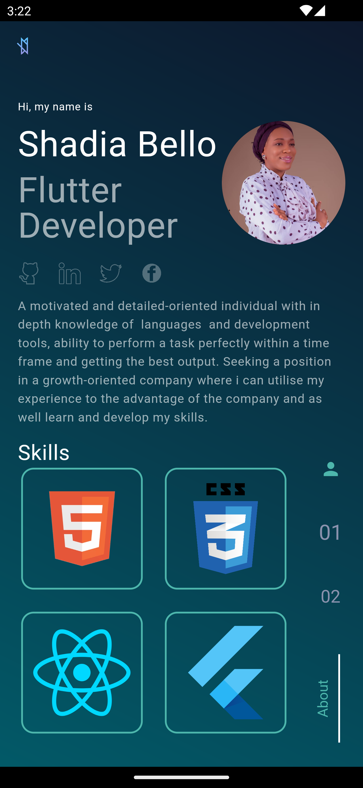
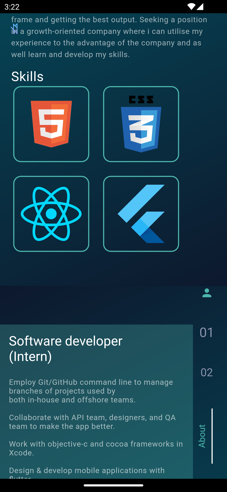
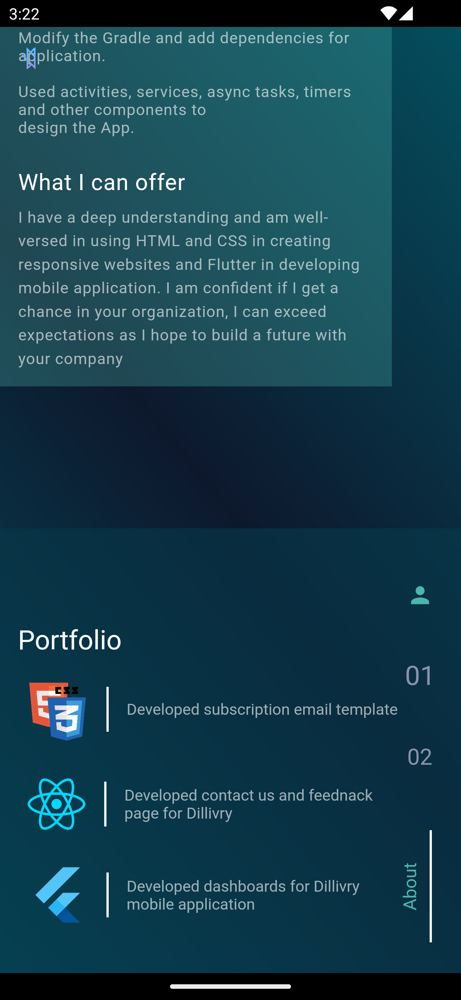
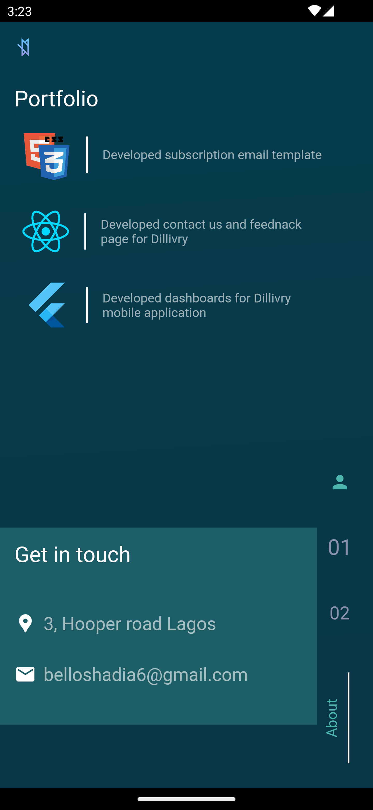

# Project Title
Portfolio

## Demo link:
Access my site at [appetize.io](https://appetize.io/app/4qmchvi2rxcey26lrwztfcrspm)

## Table of Content:

- [About The App](#about-the-app)
- [Screenshots](#screenshots)
- [Technologies](#technologies)
- [Setup](#setup)
- [Approach](#approach)
- [Status](#status)
- [Challenges](#credits)
- [Next to do](#credits)
- [License](#license)

## About The App
Portfolio is an app that shows my competence, skills and capabilty being a Mobile Application Developer.

It consists of three page sections namely; About section, Experience section and Contact details section.

This app allows routing to my social media pages and also has a custom vertical navogation group of buttons.

It is a very simply mobile application which has been checked against responsiveness

## Screenshots

``

 

 

 

## Technologies
I used `flutter` to develop the mobile application. I also used some dependencies which includes;

1. shared preferences: To save data or values temporarily.

2. provider: For app state management and control.

3. url_launcher: To launch http urls through device's default browser.

## Setup
- download or clone the repository
- run `flutter pub get`
- run `flutter run` or `click on the play button your IDE`

## Approach
I adopted the Repository pattern of application architecture. At the moment, two folders `blocs` and `widget` have been created.

The blocs folder: This folder contains configurations for theme manager

The work widget: This folder contains UI components of the app.

## Status
Portfolio is still in progress. `Version 2` will be out soon.

## Challenges
=> Had issues configuring the theme manager properly

## Next To do
=> Theme management (Dark and light mode)
=> Language builder and management

## License

MIT license @ [author](author.com)